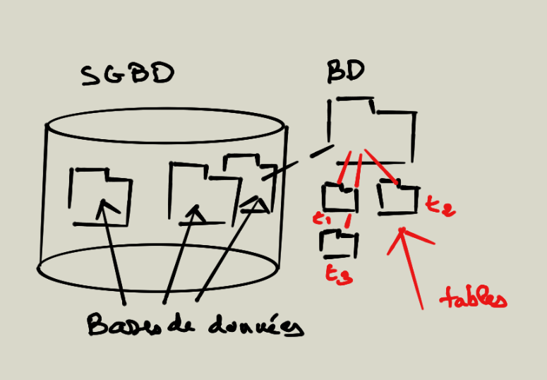

# 📚 SQL : Structured Query Language

## 🌟 Introduction

Dans ce cours, vous utiliserez **VSCode** pour écrire des requêtes que nous exécuterons en ligne de commande. 🚀

---

## 🛠️ Installation : MAC & Windows

### 💻 Installation sur MAC

1. **Téléchargez MAMP pour MAC**  
   👉 [Lien de téléchargement](https://documentation.mamp.info/en/MAMP-Mac/index.html)

2. **Installez MAMP** dans le dossier Applications sur votre Mac.

3. **Vérifiez l’installation de MySQL avec MAMP**  
   - Assurez-vous que **MAMP** est fonctionnel.  
   - Notez le chemin du binaire MySQL :
     ```bash
     /Applications/MAMP/Library/bin/
     ```

4. **Ajoutez les binaires MySQL à `/usr/local/bin`**  
   - Ouvrez le **Terminal**.  
   - Créez des liens symboliques pour accéder plus facilement aux commandes MySQL :  
     ```bash
     sudo ln -s /Applications/MAMP/Library/bin/mysql /usr/local/bin/mysql
     sudo ln -s /Applications/MAMP/Library/bin/mysqldump /usr/local/bin/mysqldump
     sudo ln -s /Applications/MAMP/Library/bin/mysqladmin /usr/local/bin/mysqladmin
     ```

5. **Testez votre installation**  
   - Vérifiez que MySQL est installé :  
     ```bash
     mysql --version
     ```  
   - Connectez-vous à MySQL :  
     ```bash
     mysql -u root -p -P [PORT]
     ```  
     Remplacez `[PORT]` par le port MySQL utilisé par MAMP (par défaut : `3306` ou `8889`).

---

### 🖥️ Installation sur Windows

1. **Téléchargez MAMP pour Windows**  
   👉 [Lien de téléchargement](https://documentation.mamp.info/en/MAMP-Windows/index.html)

2. **Installez MAMP**  
   - Suivez les étapes d’installation.  
   - Par défaut, MySQL est installé ici :  
     ```text
     C:\MAMP\bin\mysql\bin
     ```

3. **Ajoutez MySQL à la variable PATH**  
   - Ouvrez **Paramètres système** (recherchez "Variables d’environnement").  
   - Ajoutez le chemin suivant à la variable `Path` :  
     ```text
     C:\MAMP\bin\mysql\bin
     ```

4. **Testez votre installation**  
   - Ouvrez une **Invite de commande** et tapez :  
     ```cmd
     mysql --version
     ```  
   - Connectez-vous à MySQL :  
     ```cmd
     mysql -u root -p -P [PORT]
     ```  
     Remplacez `[PORT]` par `3306` ou `8889`.

---

## 🧪 Commandes de Base MySQL

- **Afficher les bases de données disponibles**  
  ```sql
  SHOW DATABASES;
  ```

- **Créer une base de données**  
  ```sql
  CREATE DATABASE testdb;
  ```

- **Utiliser une base de données**  
  ```sql
  USE testdb;
  ```

- **Quitter MySQL**  
  ```sql
  exit;
  ```

---

## 📖 SQL : Historique et Concepts

Le **SQL (Structured Query Language)** a vu le jour dans les années 1970 au sein des laboratoires d'IBM, sous l'impulsion d'**Edgar F. Codd**, un informaticien britannique considéré comme le père des bases de données **relationnelles**.  

### Origines  

- En 1970, Edgar Codd publie un article révolutionnaire intitulé *"A Relational Model of Data for Large Shared Data Banks"*. Cet article définit les bases des bases de données relationnelles et met en avant un modèle basé sur des tables pour organiser les données.  

- Suite à cette publication, IBM développe un projet de recherche nommé **System R** au milieu des années 1970. Ce projet donne naissance à un langage initialement nommé **SEQUEL** (Structured English Query Language), conçu pour interagir avec les bases de données relationnelles.  

- Cependant, en raison d'un conflit juridique sur le nom "SEQUEL", il a été rebaptisé **SQL**.  

### Normalisation  

- En 1986, l'ANSI (American National Standards Institute) publie la première norme officielle pour le langage SQL. Cette standardisation marque un tournant, car elle permet aux développeurs de travailler avec un langage commun, indépendamment des fournisseurs de bases de données.  

- En 1987, l'ISO (International Organization for Standardization) adopte également le SQL comme norme internationale. Depuis lors, le langage a connu plusieurs mises à jour pour intégrer de nouvelles fonctionnalités, comme les transactions, les procédures stockées et la gestion des données JSON.  

### Impact  

SQL a été adopté massivement dans le monde entier grâce à sa simplicité et sa capacité à gérer efficacement des bases de données relationnelles. Aujourd'hui, il reste un outil essentiel pour les développeurs, les administrateurs de bases de données et les analystes. 🌟  

---  


## 🔍 Groupes de Commandes SQL

1. **DDL : Data Definition Language**  
   👉 `CREATE`, `ALTER`, `DROP`, `RENAME`  
   *Pour créer ou modifier des tables.*

2. **DQL : Data Query Language**  
   👉 `SELECT`  
   *Pour extraire des données.*

3. **DML : Data Manipulation Language**  
   👉 `INSERT`, `DELETE`, `UPDATE`  
   *Pour manipuler les enregistrements.*

4. **DCL : Data Control Language**  
   👉 `GRANT`, `REVOKE`, `COMMIT`, `ROLLBACK`  
   *Pour gérer les droits et les transactions.*

---

## 💡 Pourquoi MySQL ?

- **Avantages** :  
  ✅ Multiplateforme  
  ✅ Performances élevées pour les requêtes de lecture (DQL).

- **Inconvénients** :  
  ❌ Moins adapté aux bases de données de très grande taille.

---

## 📊 Structure de Données

Une base de données est constituée de tables, elles-mêmes constituées de colonnes et lignes :  

```text
+----+----------------+---------------+
| id | name           | department    |
+----+----------------+---------------+
|  1 | Cousin         | Haute-Garonne |
|  2 | Sauvage        | Guadeloupe    |
|  3 | Guerin         | Mayenne       |
|  4 | Jacquet        | Val-de-Marne  |
+----+----------------+---------------+
```

- `id` : Type **INTEGER**  
- `name` : Type **VARCHAR**  
- `department` : Type **VARCHAR**

---

## 🌍 Jeu de Caractères & Collation

- **UTF8** : Utilisé pour représenter des caractères internationaux.  
  - Exemple : Le caractère `é` est codé sur **2 octets** en UTF8.  
  - Recommandé pour les projets Web.

- **Collation** : Définit comment sont triés et comparés les caractères.  
  - Nous utiliserons :  
    - `utf8_general_ci` : Insensible à la casse, rapide pour les recherches.  
    - `utf8mb4_unicode_ci` : Permet de gérer plus de caractères.  

---

## 🖼️ Illustrations

- **Schéma d’un SGDB :**  
  

- **Connexion à un serveur de bases de données :**  
  

---

### 🎯 Résumé

Avec **MySQL**, nous travaillerons avec des bases de données en encodage **UTF8** pour garantir la compatibilité internationale. La collation choisie permettra des recherches rapides et insensibles à la casse.

🚀 Vous êtes prêts à plonger dans le monde des bases de données ! 🌟