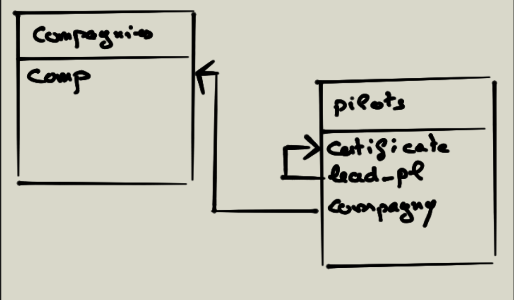

# Exercices sur les jointures SQL

Ce chapitre contient une série d'exercices pratiques pour approfondir votre compréhension des jointures SQL, en incluant des cas concrets et des manipulations avancées.

---

## **01 - Ajouter une clé étrangère**

Ajoutez une clé étrangère `lead_pl` dans la table **pilots**. Cette clé étrangère se réfère à la clé primaire de la même table. Cela permet d'établir une relation hiérarchique où un pilote peut être le leader d'autres pilotes.

**Schéma relationnel :**

1. **Mise à jour des données**  
   - Ajoutez les relations suivantes :
     - **Pierre** est le chef pilote de **Alan**, **Tom** et **Yi**.  
     - **John** est le chef pilote de **Sophie**, **Albert** et **Yan**.

2. **Requête SQL à écrire :**  
   Déterminez les pilotes qui n'ont pas de chef pilote en utilisant une **jointure interne**.

---

## **02 - Exercices sur les jointures**

### **A - Certificats et compagnies**  
Écrivez une requête SQL pour :  
- Afficher les certificats des pilotes et les noms des compagnies pour lesquelles ils travaillent.

### **B - Pilotes spécifiques**  
Écrivez une requête SQL pour :  
- Sélectionner les certificats et les noms des pilotes travaillant pour la compagnie **'Air France'** ayant effectué plus de **60 heures de vol**.

---

## **03 - Somme des heures de vol**

### **A - Total par compagnie spécifique**  
- Faites la somme des heures de vol de tous les pilotes de la compagnie **'AUSTRA Air'**.  
- Recherche par rapport au nom de la compagnie dans la table **companies**.

### **B - Total par toutes les compagnies**  
- Faites la somme des heures de vol pour chaque compagnie en affichant également le **nom des compagnies**.

---

## **04 - Somme des profits par condition**

Calculez la somme des **profits des compagnies** qui emploient au moins un pilote ayant effectué plus de **150 heures de vol**. Affichez le **nom des compagnies** dans le résultat.

---

## **Rappel : Jointures externes**

Une jointure externe permet d'extraire des enregistrements qui ne satisfont pas les critères de jointure.  
- Une des deux tables est dite **dominante**, l'autre étant **subordonnée**.  
- Les enregistrements de la table dominante sont toujours retournés, même s'ils ne remplissent pas les conditions de jointure.  

---

## **05 - Pilotes et compagnies**

1. **Affichage avancé des données**  
   Écrivez une requête SQL pour :  
   - Sélectionner le **nom de la compagnie**, le **certificat du pilote** et le **nom du pilote**, même si la compagnie n'emploie pas de pilote.  

2. **Insertion de données**  
   Ajoutez un pilote avec les informations suivantes :  
   - **Nom :** Harry  
   - **Certificat :** ct-19  
   - Aucun chef pilote, aucune compagnie, 0 heure de vol, bonus de 100, 0 jour de travail, aucun vol planifié, date de naissance : `'2000-01-01 12:00:00'`.

3. **Affichage avec jointure externe**  
   Sélectionnez le **nom de la compagnie**, le **certificat du pilote**, et le **nom du pilote**, même si le pilote n'est pas rattaché à une compagnie.

---

## **06 - Exercices sur FULL OUTER JOIN**

### **A - Jointure bilatérale (FULL OUTER JOIN)**  
Sélectionnez les compagnies et leurs pilotes en incluant :  
- Les compagnies n'ayant pas de pilote.  
- Les pilotes n'ayant pas de compagnie.  

**Indication :**  
Utilisez la clause **UNION** pour simuler une **FULL OUTER JOIN** dans les bases de données comme MySQL.  
- **Note importante :** Avec la clause **UNION**, les enregistrements identiques ne seront pas dupliqués dans les résultats.

### **B - Données exclusives**  
Affichez uniquement :  
- Les compagnies sans pilote.  
- Les pilotes sans compagnie.

---
